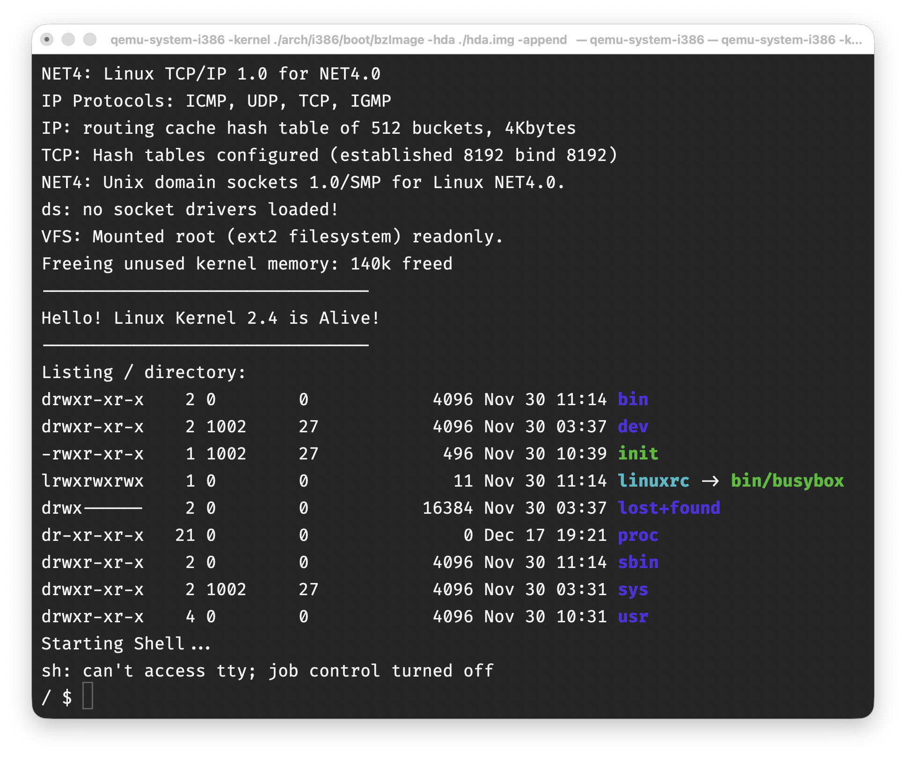

# Legacy Kernel 2001: Linux2.4 Env

After  [TreeNewBeer]  | Marcuz-apl | 2025-12-17                                                                                                


## Intro

As of 1 December 2025, the kernel has been envoleved to 6.18, but a older and simpler kernel shall help us to get the know-how of the Kernel.

Occassionally, the "__Linux Kernel Source Code Scenario Analysis__ (PDF file attached)" pops up with way clearer interpretation of how kernel works. The Book and its code are based on Kernel 2.4.0.

Let's get hands dirty.


## Env Establishment

Kernel 2.4, released in 2001, is too old to be compatible with the current GCC compiler.

Then, docker container is introduced to resolve the compatibility issue, using Dedian Sarge release, which embeds GCC3.3. as such we could apply the QEMU on the host to test-run it.

Please note, Kernel 2.4.0 introduces quite a lot of compiling errors, then we select Kernel 2.4.37.


## Spin up a old Debian container

```bash
git clone https://github.com/hlleng/kernel2.4-lab.git
cd kernel2.4-lab
docker run --platform linux/386 -it -v $(pwd):/code debian/eol:sarge /bin/bash
```

Once entering into docker container, update the repo sources and install the packages as needed.

```bash
apt-get update
apt-get install -y gcc make binutils libncurses5-dev wget bzip2
## may need to update the PATH
export PATH="$PATH:/usr/bin:/usr/sbin"
```


## Compile the Kernel

```bash
cd code
# Config: --> "Exit" -> "Yes" (Save)
/usr/bin/make ARCH=i386 menuconfig
# Make the dependencies
make ARCH=i386 dep
# Make the booting linux image
make ARCH=i386 bzImage
### the kernel shall be at `/code/arch/i386/boot` folder.

# Exit to the host
exit
```


## Generate file system for testing

The making of his.img could be done as below:

```bash
# Install qemu toolkit, which could take quite a while, be patientß
# sudo apt-get install qemu
brew install qemu
# Create the hda.img of 100MB size
qemu-img create -f raw hda100.img 100M
```

Actually, what we need to do are: 

- create an image with the `ext2` filesystem (that's the predominant Linux filesystem in 2001)
- Prepare the user space with busybox
- Create an `init` script  the image to avoid kernel panic

#### A- Create the raw image

```shell
## create a mounting folder
mkdir $HOME/linuxfs
docker run --privileged -it -v $HOME/linuxfs:/linuxfs debian:bookworm bash
## you will be in a # prompt of `debian:bookworm`
```

Then, create a raw disk image, basically it's a blank file and format it as `fat`.

```shell
## Create the blank file
dd if=/dev/zero of=hda100.img bs=1M count=100
## Format as msdos with `dosfstools`
mkfs -t fat hda100.img
```

(OPTIONALLY) Verify the image inside the docker container:

```shell
## resume from above
losetup -fP --show hda100.img
#### This will return a /dev/loop0 ID, e.g. /dev/loop0

## Mount it up
mount /dev/loop0 /linuxfs
## Enter the directory to see if it's formatted correctly
cd /linuxfs
ls -alh
#### total 20K
#### drwxr-xr-x 3 root root 4.0K Dec  5 23:47 .
#### drwxr-xr-x 5 root root  160 Dec  5 23:46 ..
#### drwx------ 2 root root  16K Dec  5 23:47 lost+found

## Umount it
umount /linuxfs
```

Then Copy the image to the mapped folder and exit the container.

```shell
## Copy the image to the folder
mv hda100.img /linuxfs

## Exit the container
exit
```

#### B- Prepare the user space with BusyBox

Busybox is a bundle of many basic Linux utilities, for example `ls`, `grep`, and `vi` are all included.

```shell
## Back to project folder
cd ../
mkdir busybox
## Download the BusyBox source code
wget https://github.com/mirror/busybox/archive/refs/tags/1_36_1.tar.gz && tar -xf 1_36_1.tar.gz -C busybox --strip-components=1
## Enter the fodler
cd busybox

## Edit busybox config
make menuconfig
```

Please Go to `Settings --->` and toggle `[ ] Build static binary (no shared libraries)`. 

Now Let's build it.

```shell
make -j$(nproc)
```

Now Install the compiled busybox into a folder `initfamfs`:

```shell
mkdir $HOME/initramfs
make CONFIG_PREFIX=$HOME/initramfs install
```

Perform a little cleanup:

```shell
rm $HOME/initramfs/linuxrc
ls -lah $HOME/initramfs
```

#### C- Create an init script

The kernel needs something to execute. It looks in `/init` for this file. On a normal linux system, this is a systemd binary, but here, it's just a shell script.

```shell
cd $HOME/initramfs
nano init
```

Put the following contents into the file **init**:

```text
#!/bin/sh

# 1. mount proc filesystem (kernel info here)
/bin/busybox mount -t proc proc /proc

# 2. Print welcome info
echo "--------------------------------"
echo "Hello! Linux Kernel 2.4 is Alive!"
echo "--------------------------------"

# 3. List root filesystem
echo "Listing / directory:"
/bin/busybox ls -l /

# 4. Start the interactive Shell
echo "Starting Shell..."
# exec indicates using sh to replace current process to save memory
exec /bin/busybox sh
```

The change the mode of **init**.

```shell
chmod +x ./init
```

#### D- Create the initramfs archive

An initramfs is a `cpio archive`. This archive needs to contain all of the files in `initramfs/`, and pass it to `cpio` to create the archive saving to the parent folder (in this specific format):

```sh
mkdir $HOME/boot
find . | cpio -o -H newc > $HOME/boot/initrd.img
## the file name was init.cpio, i renamed as initrd.img, the same way as in Ubuntu
```

`-o` creates/outputs a new archive, and `-H newc` specifies the type of the archive.

#### E- Install the boot loader (syslinux)

We can install `syslinux` onto the `hda100.img` file created at Step A:

```shell
syslinux $HOME/linuxfs/hda100.img
```

#### F- Copy the initramfs files to the image

We need to mount that image:

```shell
mkdir m
mount $HOME/linuxfs/hda.img m
## Copy the files over
cp initrd.img m/
du -sh m
## umount and remove
umount m
rmdir m
```


Simply, use the ready-to-use `had.img` (64GB) for later practice.


## Test Run the legacy Kernel on the Host

Execute `QEMU`, loading the kernel and file system.

```bash
## Still in kernel2.4-lab folder
qemu-system-i386\
   -kernel ./arch/i386/boot/bzImage \
   -hda ./hda.img \
   -append "root=/dev/hda init=/init console=ttyS0" \
   -nographic
```

As of now, we shall be okay to enter into the kernel system.



Press "**Ctrl+A**" and "**x**" to exit the Qemu in Terminal.


## Copy files

If needing to copy files from the Host to the `QEMU` system, please try to. steps below on the Host.

```bash
> mkdir -p tmp/mnt
> sudo mount -o loop hda.img tmp/mnt
# execute the copying file operations
> sudo umount tmp/mnt
```

As of now, we have created an env of Kernel 2.4.37, where we could play around the legacy kernel.


## The End